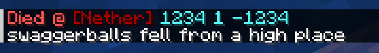
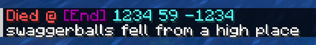

# Minecraft Death Logger

###### _Super simple minecraft death logger to make finding your stuff easier_

## Features
- Logs your death location in chat
- Only you can see your death location
- Different message for all dimensions

## Screenshots

###### _Yes, that's actually my minecraft username..._

## Requirements
- PaperMC or Spigot or Bukkit

## Installation
I'm too lazy to make a release for this, so I just put the binary
in the `/bin` directory
 
You can then just drag and drop it in your server's /Plugins directory

## Notes
- This plugin was made a long time ago, it should still work fine in later versions though
- The original API version supported for this plugin is 1.20

## License
This project uses the `GNU GENERAL PUBLIC LICENSE v3.0` license 
For more info, please find the `LICENSE` file: [License](LICENSE)